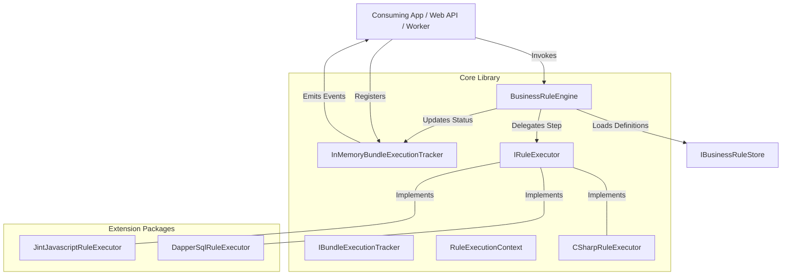
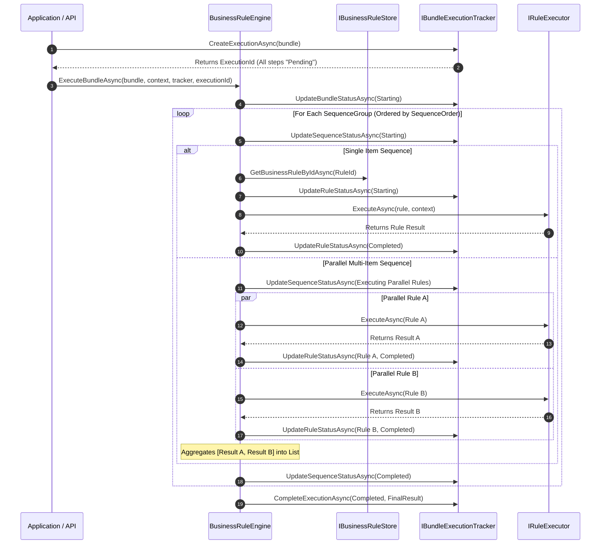
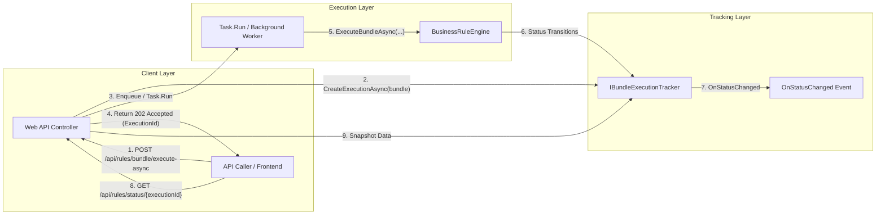
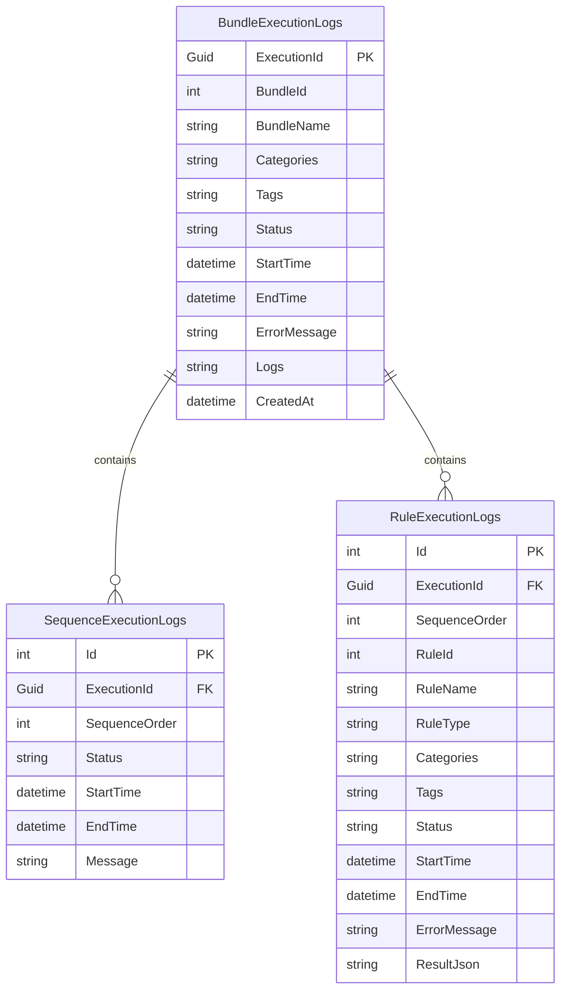
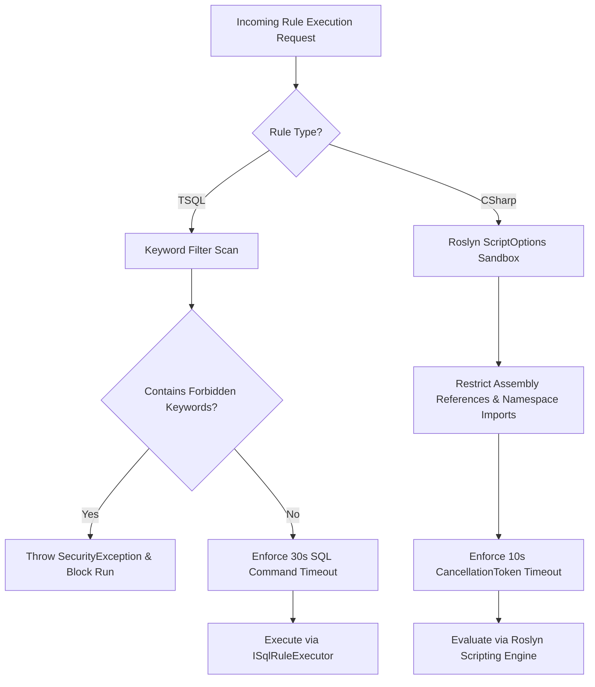

# Architecture Overview - EtlAnalytics.RulesEngine

`EtlAnalytics.RulesEngine` is a lightweight, database-agnostic, multi-targeted (.NET 8 & .NET 10) business rules engine supporting T-SQL, C# Scripting, and JavaScript.

This document provides a comprehensive architectural breakdown of the engine, its pluggable execution pipeline, sequence orchestration, asynchronous tracking framework, and security sandboxing.

---

## 1. System Architecture Diagram

The engine follows a modular, decoupled architecture where the core logic ("Brain") remains independent of concrete database providers ("Hands").

---

## 2. Pluggable Package Hierarchy

To maintain zero unnecessary dependencies, the library is split into a core package and optional provider extensions:

| Package | Purpose | Dependencies |
| :--- | :--- | :--- |
| **`EtlAnalytics.RulesEngine`** | Core orchestrator, C# script executor, sandboxing, and in-memory/abstract status tracking. | `Microsoft.CodeAnalysis.CSharp.Scripting`, `Microsoft.Extensions.Configuration.Abstractions` |
| **`EtlAnalytics.RulesEngine.Dapper`** | Provides SQL Server, PostgreSQL, and MySQL T-SQL execution. | `Dapper`, `Microsoft.Data.SqlClient`, `Npgsql`, `MySqlData` |
| **`EtlAnalytics.RulesEngine.Javascript`** | Provides browser-like JavaScript rule execution. | `Jint` |

---

## 3. Bundle Orchestration & Parallel Execution Pipeline

When executing a `BusinessRuleBundle`, the engine groups items by `SequenceOrder`. Items sharing the same sequence number run concurrently in parallel via `Task.WhenAll`.

---

## 4. Asynchronous Execution & Real-Time Observer Pattern

To prevent long-running rule bundles from blocking API HTTP threads, execution tracking uses an asynchronous non-blocking observer model:

---

## 5. Persistent Tracking Data Schema

For hosts using database persistence via `SqlBundleExecutionTracker`, the relational schema models parent bundle runs, sequence groups, and individual rules:

---

## 6. Security & Sandboxing Architecture

To ensure execution safety when running dynamic user-defined logic, the engine enforces multi-layered sandboxing:

