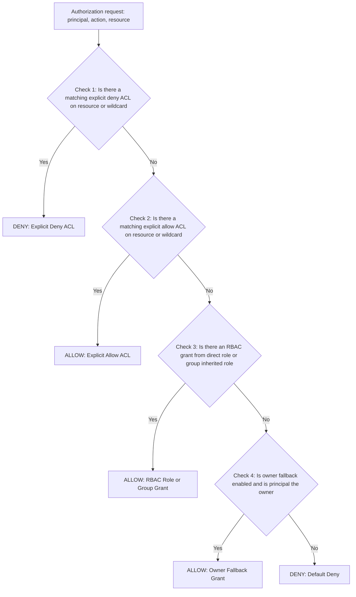

# RBAC, Group, and ACL Processing Guide

This guide defines the recommended authorization model for applications that use `EtlAnalytics.RulesEngine` and `DataForge`.

The design is intentionally platform-independent:
- Windows AD environments (`USE_WINDOWS_AUTH`)
- Linux or Windows container hosts (`USE_AD_FORM_AUTH`)
- Local development identity switcher (`CustomAuthenticationStateProvider`)
- JWT or OIDC claims

The package remains provider-agnostic. The consuming application owns policy decisions and identity mapping.

---

## 1. Responsibility Split

### Application Responsibilities
- Authenticate users or service principals.
- Normalize claims and group membership.
- Author and manage RBAC, group-role mappings, and ACL entries.
- Decide access for CRUD, connection, and execution actions.
- Persist security decision audits.

### Package Responsibilities
- Expose enforcement hooks and contracts.
- Invoke authorization checks before protected operations.
- Propagate actor metadata through execution tracking and model updates.
- Stay neutral to identity provider details.

---

## 2. Authorization Objects

### Principals
- User principal
- Group principal
- Role principal
- Service principal (for automation)

### Resources
- Rule
- Rule bundle (`Bundle` or `RuleBundle`)
- Connection
- Role definition
- Role-bundle mapping
- Execution record

### Actions
- Create
- Read
- Update
- Delete
- Execute / Use (interchangeable execution action aliases)
- Manage

---

## 3. Evaluation Order

Use this deterministic order for every authorization check:

1. **Explicit Deny ACL** on the target resource or wildcard `*`.
2. **Explicit Allow ACL** on the target resource or wildcard `*`.
3. **Role-Based Permission Grants** (direct user roles and group-inherited roles).
4. **Owner Fallback Grant** (creator default manage rights) if active.
5. **Default Deny**.

Recommendation: explicit deny always wins.

---

## 4. Connection Permissions, Action Aliases & Domain Normalization

- **Role/Group Connection Permissions**: Users in execution roles (such as `RuleExecutor`) are granted base `Execute`, `Use`, and `Read` permissions on `Connection` resources in `dbo.RolePermissions`. This allows them to execute rules and bundles across default and non-default connections based on role membership.
- **Interchangeable Action Aliases**: `RuleAuthorizationService` evaluates **`Action = 'Execute'`** and **`Action = 'Use'`** interchangeably across `dbo.RolePermissions` and `dbo.ResourceAcls`. An engine request for connection `Use` matches role grants for `Execute`, and vice versa.
- **Domain Username Normalization**: Username matching in `RuleAuthorizationService` automatically evaluates domain-qualified forms (`DOMAIN\username`, `username`, `username@domain.com`) against `dbo.UserRoles` and `dbo.ResourceAcls`, ensuring Active Directory logins (e.g. `RSYSLAB\U00001`) match user role assignments regardless of string format.
- **AD Group Claim Extraction**: `RuleAuthorizationService` automatically extracts Active Directory group membership claims (`ClaimTypes.Role`, `groups`, `memberOf`) via `IHttpContextAccessor` for `dbo.GroupRoles` evaluation.
- **Resource ACL Overrides**: Explicit `Deny` or `Allow` entries in `dbo.ResourceAcls` take precedence over base role permissions. An explicit `Deny` ACL on a sensitive connection blocks execution even if the user is in the `RuleExecutor` role.
- **Dual Execution Pre-Checks**: When executing a Rule or Rule Bundle, `RuleAuthorizationService.AuthorizeExecutionWithConnectionsAsync(...)` verifies authorization for both:
  1. The target `Rule` or `RuleBundle` (`Action = 'Execute'`).
  2. Each referenced `Connection` (`Action = 'Execute'` / `'Use'`).

---

## 5. Minimal Permission Matrix

| Resource | Create | Read | Update | Delete | Execute / Use | Manage |
| :--- | :---: | :---: | :---: | :---: | :---: | :---: |
| Rule | Yes | Yes | Yes | Yes | Yes | Yes |
| Rule bundle | Yes | Yes | Yes | Yes | Yes | Yes |
| Connection | Yes | Yes | Yes | Yes | **Yes** | Yes |
| Role definition | Yes | Yes | Yes | Yes | No | Yes |
| Role-bundle mapping | Yes | Yes | Yes | Yes | No | Yes |
| Execution record | No | Yes | No | Optional | No | Optional |

---

## 6. Auditing Requirements

Track who and when for all protected operations:
- `CreatedBy`, `CreatedByName`, `CreatedAtUtc`
- `ModifiedBy`, `ModifiedByName`, `ModifiedAtUtc`
- `ExecutedBy`, `ExecutedByName`, `ExecutionStartUtc`, `ExecutionEndUtc`

For authorization decisions, record in `dbo.AuthorizationDecisionAudit`:
- Principal id and Principal type
- Resource type and Resource id
- Action (`Create`, `Read`, `Update`, `Delete`, `Execute`, `Use`, `Manage`)
- Decision (`Allow` or `Deny`)
- Decision source (`Explicit Deny ACL`, `Explicit Allow ACL`, `RBAC Role Grant`, `Group Inherited Grant`, `Owner Fallback Grant`, `Default Deny`)
- Decision Correlation ID

---

## 7. Built-in System Roles & Admin Capabilities

The system seeds four default system roles in `dbo.Roles`:

### 👑 Admin Role
The **`Admin`** role provides unrestricted administrative, authoring, execution, and security policy capabilities across all resources.

#### Unrestricted Granted Capabilities
| Resource Type | Granted Actions | What an Admin Account Can Do |
| :--- | :--- | :--- |
| **`Rule`** | `Create`, `Read`, `Update`, `Delete`, `Execute`, `Manage` | Create rules, edit C# Roslyn / T-SQL code, version rules, delete rules, and run interactive rule executions. |
| **`Bundle`** / **`RuleBundle`** | `Create`, `Read`, `Update`, `Delete`, `Execute`, `Manage` | Author, edit, and delete multi-stage rule bundles; trigger synchronous and asynchronous parallel bundle runs. |
| **`Connection`** | `Create`, `Read`, `Update`, `Delete`, `Execute`, `Use`, `Manage` | Add/edit database connections (`SqlServer`), test/decrypt connection strings, delete connection definitions, and execute rules across all connections. |
| **`RoleDefinition`** | `Create`, `Read`, `Update`, `Delete`, `Manage` | Create custom roles, edit role descriptions, delete roles, and configure the permission matrix checkboxes per role. |
| **`RoleBundleMapping`** | `Create`, `Read`, `Update`, `Delete`, `Manage` | Assign or revoke system roles for specific users (`dbo.UserRoles`) and Active Directory / OIDC groups (`dbo.GroupRoles`). |
| **`ResourceAcls`** | `Create`, `Read`, `Update`, `Delete`, `Manage` | Add, edit, or delete explicit **Allow** and **Deny** per-resource ACL overrides in `dbo.ResourceAcls`. |
| **`ExecutionRecord`** | `Read`, `Delete`, `Manage` | View all historical bundle execution trees (`dbo.BundleExecutionLogs`), sequence logs, step logs, actor contexts, and decision audit logs. |

#### Exclusive Administrative Capabilities (`/rbac-admin`)
Only accounts in the **`Admin`** role can access and administer the **RBAC & Security Policy Administration** page:
1. **System Roles & Permission Matrix**: Modify checkboxes granting or revoking actions for `Admin`, `RuleAuthor`, `RuleExecutor`, `Viewer`, or custom roles.
2. **User & Group Role Mappings**: Map user identities (`admin@example.com`, `RSYSLAB\U00001`) or Active Directory Groups (`RulesEngine-Admins`, `Domain Admins`) to system roles.
3. **Resource ACL Management**: Define explicit `Allow` or `Deny` overrides for specific connection IDs, rule IDs, or bundle IDs.
4. **Authorization Decision Audit Trail**: Review real-time security decision logs (`dbo.AuthorizationDecisionAudit`) tracking evaluation stages (`Explicit Deny ACL`, `Explicit Allow ACL`, `RBAC Role Grant`, `Group Inherited Grant`, `Owner Fallback Grant`, `Default Deny`).
5. **Engine Security Policy Review**: Inspect T-SQL command timeouts (60s), Roslyn C# script timeouts (15s), assembly reference whitelists, and forbidden SQL keyword lists.

#### ACL Precedence
An **Explicit Deny ACL** in `dbo.ResourceAcls` (`Effect = 'Deny'`) on a specific resource ID will take precedence over the `Admin` role grant and block access for that specific resource instance until modified.

---

### Other Default System Roles
- **`RuleAuthor`**: Can create, view, edit, and delete rules, bundles, and connections. Cannot administer system roles or group mappings.
- **`RuleExecutor`**: Can execute rule bundles and rules across default and non-default connections, and view execution tracking logs.
- **`Viewer`**: Read-only access to view rules, bundles, connections, and historical execution tracking logs.
