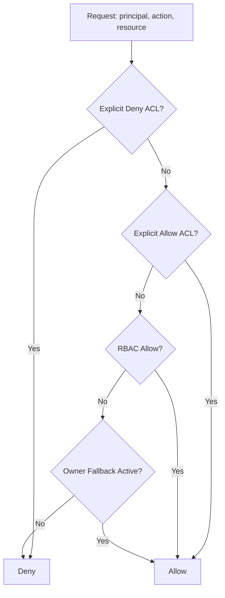

# RBAC, Group, and ACL Processing Guide

This guide defines the recommended authorization model for applications that use EtlAnalytics.RulesEngine.

The design is intentionally platform-independent:
- Windows AD environments
- Linux or macOS hosts
- Local account authentication
- JWT or OIDC claims

The package remains provider-agnostic. The consuming application owns policy decisions and identity mapping.

---

## 1. Responsibility Split

### Application Responsibilities
- Authenticate users or service principals.
- Normalize claims and group membership.
- Author and manage RBAC, group-role mappings, and ACL entries.
- Decide access for CRUD and execute actions.
- Persist security decision audits.

### Package Responsibilities
- Expose enforcement hooks and contracts.
- Invoke authorization checks before protected operations.
- Propagate actor metadata through execution tracking and model updates.
- Stay neutral to identity provider details.

---

## 2. Authorization Objects

### Principals
- User principal
- Group principal
- Role principal
- Service principal (for automation)

### Resources
- Rule
- Rule bundle
- Connection
- Role definition
- Role-bundle mapping
- Execution record

### Actions
- Create
- Read
- Update
- Delete
- Execute
- Manage

---

## 3. Evaluation Order

Use this deterministic order for every authorization check.

1. Explicit deny ACL on the target resource.
2. Explicit allow ACL on the target resource.
3. Role-based permission grants (direct user roles and group-inherited roles).
4. Owner fallback grant (creator default manage rights) if not revoked.
5. Default deny.

Recommendation: explicit deny always wins.

---

## 4. Ownership Semantics

Default ownership behavior:
- Resource creator receives Manage permission at creation time.
- Ownership-derived permission can be revoked by admin policy.
- Revocation should be explicit and auditable.

Suggested fields on protected entities:
- OwnerUserId
- OwnerPrincipalType
- OwnershipRevoked
- OwnershipRevokedAtUtc
- OwnershipRevokedBy

---

## 5. Cross-Resource Authorization

For rule bundle execution, perform preflight checks before scheduling work:
- Execute permission on the bundle.
- Read or Execute permission on each referenced rule.
- Read or Use permission on each referenced connection.

If any check fails, deny the entire execution request.

---

## 6. Application Integration Pattern

### API Pattern
1. Resolve principal from HTTP context.
2. Normalize claims and roles.
3. Call policy engine for requested action.
4. If allowed, call rule store or engine.
5. Persist allow or deny audit entry.

### Worker Pattern
1. Resolve service principal identity.
2. Evaluate policy with same engine used by APIs.
3. Execute bundle only when authorized.
4. Persist execution actor metadata.

### Admin UI Pattern
1. Manage roles and permissions.
2. Manage group-role assignments.
3. Manage per-resource ACL exceptions.
4. Review decision and change audit history.

---

## 7. Minimal Permission Matrix

| Resource | Create | Read | Update | Delete | Execute | Manage |
| :--- | :---: | :---: | :---: | :---: | :---: | :---: |
| Rule | Yes | Yes | Yes | Yes | Optional | Yes |
| Rule bundle | Yes | Yes | Yes | Yes | Yes | Yes |
| Connection | Yes | Yes | Yes | Yes | No | Yes |
| Role definition | Yes | Yes | Yes | Yes | No | Yes |
| Role-bundle mapping | Yes | Yes | Yes | Yes | No | Yes |
| Execution record | No | Yes | No | Optional | No | Optional |

---

## 8. Package Hooking Points

Recommended hook points in this repository:
- Interfaces/IBusinessRuleStore.cs: protect rule, bundle, and connection access paths.
- Services/BusinessRuleEngine.cs: enforce bundle and rule execution preflight checks.
- Interfaces/IBundleExecutionTracker.cs: carry actor identity into execution status records.
- Models/ExecutionStateModels.cs: store executor metadata and decision correlation ids.

---

## 9. Auditing Requirements

Track who and when for all protected operations:
- CreatedBy, CreatedByName, CreatedAtUtc
- ModifiedBy, ModifiedByName, ModifiedAtUtc
- ExecutedBy, ExecutedByName, ExecutionStartUtc, ExecutionEndUtc

For authorization decisions, include:
- Principal id
- Resource type and id
- Action
- Decision (allow or deny)
- Decision source (ACL deny, ACL allow, RBAC, owner fallback, default deny)
- Correlation id

---

## 10. Related Documents

- docs/RBAC_SCHEMA_DRAFT.md
- docs/ARCHITECTURE_OVERVIEW.md
- docs/DEVELOPERS_GUIDE.md
- docs/PERSISTENT_EXECUTION_TRACKING.md
- docs/ai_implementation_guide.md
