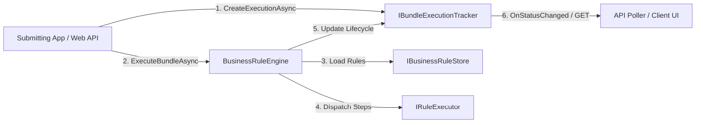

# AI Implementation Guide: EtlAnalytics.RulesEngine

This guide provides structured technical guidelines, code patterns, and best practices for AI agents (and developers using AI coding assistants) to integrate, extend, generate rules for, and operate the `EtlAnalytics.RulesEngine` package.

## Authorization and Audit Baseline

For CRUD and execution authorization, use the following split:
- **Application**: identity provider integration, claims normalization, role/group mapping, ACL decisions, and policy decision auditing.
- **Package**: reusable enforcement hooks and actor metadata propagation through execution and model lifecycle updates.

Recommended evaluation order:
1. Explicit deny ACL.
2. Explicit allow ACL.
3. Role and group grants.
4. Owner fallback grants (if enabled and not revoked).
5. Default deny.

See:
- `RBAC.md`
- `RBAC_SCHEMA_DRAFT.md`

Authorization integration options:
- Register `AddBusinessRulesEngineAuthorization()` for permissive development mode.
- Register `AddBusinessRulesEngineAuthorization<TAuthorizationService>()` for production policy evaluation.
- Enable `RulesEngine:Authorization:FailClosed=true` to require an authorization provider.

---

## Agent Runbook (Implementation Order)

Use this section as the authoritative sequence for any AI agent implementing or upgrading a host application with `EtlAnalytics.RulesEngine`.

### Step 0: Preflight and Scope

1. Confirm target framework and package version compatibility (`net8.0` or `net10.0` host recommended).
2. Detect whether the host app has existing rule/execution tables.
3. Choose deployment mode:
   - **Greenfield**: create schema from scratch.
   - **Existing deployment**: apply idempotent `ALTER TABLE` scripts first.

### Step 1: Database and Migration Strategy

1. Apply base schema from `SCHEMA_UPGRADE.md`.
2. For existing deployments, apply actor metadata migration appendix from `PERSISTENT_EXECUTION_TRACKING.md` section 4.
3. Validate `BundleExecutionLogs` contains:
   - `ExecutedBy`
   - `ExecutedByName`
   - `ActorType`
   - `AuthMethod`
   - `DecisionCorrelationId`

Do not proceed to execution integration until these columns exist in persistent tracking environments.

### Step 2: Dependency Injection Wiring

Register the tracker and authorization integration in startup:

```csharp
builder.Services.AddBusinessRulesEngineTracking();

// Development mode only (allows all requests):
// builder.Services.AddBusinessRulesEngineAuthorization();

// Production mode (recommended):
builder.Services.AddBusinessRulesEngineAuthorization<MyRuleAuthorizationService>(ServiceLifetime.Scoped);
```

Set fail-closed mode in production:

```json
{
  "RulesEngine": {
    "Authorization": {
      "FailClosed": true
    }
  }
}
```

### Step 3: Application Authorization Contract

Implement `IRuleAuthorizationService` in the consuming application. The policy engine must evaluate, at minimum:
1. Bundle execute permission.
2. Rule execute permission.
3. Connection use permission (for SQL-backed rules).

Recommended evaluation order:
1. Explicit deny ACL.
2. Explicit allow ACL.
3. Role/group grants.
4. Owner fallback.
5. Default deny.

### Step 4: Actor Context Construction

Always construct and pass `ExecutionActorContext` from the host identity layer:

```csharp
var actorContext = new ExecutionActorContext
{
    ActorId = principal.UserId,
    ActorName = principal.DisplayName,
    ActorType = "User",
    AuthMethod = "JWT",
    DecisionCorrelationId = decisionCorrelationId,
    Metadata = new Dictionary<string, string>
    {
        ["tenant"] = principal.TenantId,
        ["clientApp"] = "RulesApi"
    }
};

context.ActorContext = actorContext;
```

### Step 5: Execution Call Pattern

Use one of the following authorization paths:
- **Injected service path**: rely on registered `IRuleAuthorizationService`.
- **Per-request callback path**: pass `authorizeAsync` delegate to `ExecuteBundleAsync` or `ExecuteRuleAsync`.

Per-request callback example:

```csharp
async Task<bool> AuthorizeAsync(AuthorizationRequest req)
{
    return await policyEvaluator.IsAllowedAsync(principal, req.ResourceType, req.ResourceId, req.Action);
}

await engine.ExecuteBundleAsync(
    bundle,
    context,
    appendLog: logger.LogInformation,
    tracker: tracker,
    executionId: executionId,
    actorContext: context.ActorContext,
    authorizeAsync: AuthorizeAsync);
```

Important behavior:
- If both callback and service are available, callback is evaluated first.
- If no callback/service is provided and fail-closed is enabled, execution throws by design.

### Step 6: CRUD Enforcement Pattern

Apply authorization checks in the application service/API layer before invoking store mutations:
1. `Create` Rule/Bundle/Connection.
2. `Read` Rule/Bundle/Connection.
3. `Update` Rule/Bundle/Connection.
4. `Delete` Rule/Bundle/Connection.
5. `Execute` Bundle/Rule.

Record lifecycle audit metadata (`CreatedBy`, `ModifiedBy`, timestamps) on all protected entities.

### Step 7: Tracking and Audit Verification

After one test execution, verify:
1. `BundleExecutionLogs` row contains actor metadata values.
2. Sequence and rule rows are linked via `ExecutionId`.
3. Decision correlation id is stored and queryable.
4. Denied operations generate `UnauthorizedAccessException` and an app-level audit record.

### Step 8: Production Hardening

1. Keep `FailClosed=true` in non-dev environments.
2. Keep package authorization provider-agnostic; do not hardcode identity provider logic in package extensions.
3. Add integration tests for:
   - Deny-path bundle execution.
   - Callback precedence over injected service.
   - Missing provider + fail-closed throws.
   - Actor metadata persistence.

---

## 1. Quick Reference Architecture



### Core Components
- **`BusinessRuleEngine<TContext>`**: Main orchestrator. `TContext` inherits from `RuleExecutionContext`.
- **`IBusinessRuleStore`**: Sourcing interface for `BusinessRule`, `BusinessRuleBundle`, and `DbConnectionDefinition`.
- **`IBundleExecutionTracker`**: Thread-safe observer and state store for async monitoring (`Pending` $\rightarrow$ `Starting` $\rightarrow$ `Completed` / `Failed` / `Skipped`).
- **`IRuleExecutor` / `ISqlRuleExecutor`**: Language-specific execution implementations (TSQL, C#, Javascript).

---

## 2. Model Definitions & Properties

### `BusinessRule`
- `Id` (`int`): Primary key.
- `Name` (`string`): Unique rule identifier.
- `RuleType` (`string`): Language type string (`RuleConstants.TSQL`, `RuleConstants.CSharp`, `"Javascript"`).
- `Code` (`string`): Executable script body.
- `ConnectionId` (`int?`): Optional connection link to run T-SQL rules against cross-database instances.
- `Categories` (`List<string>`): Organizational tags (e.g., `["Finance", "Compliance"]`).
- `Tags` (`List<string>`): Searchable labels (e.g., `["PCI-DSS", "Nightly"]`).

### `BusinessRuleBundle`
- `Name` (`string`): Bundle identifier.
- `Items` (`List<BusinessRuleBundleItem>`): Sequence items containing `RuleId` and `SequenceOrder`.
- `Categories` (`List<string>`): Organizational categories.
- `Tags` (`List<string>`): Searchable labels.

### `RuleExecutionContext` (Base Class)
- `PreviousResult` (`object?`): Result from the preceding step (or `List<object?>` if following a parallel group).
- `StepResults` (`Dictionary<int, object?>`): Historical step results indexed by `SequenceOrder`.
- `CancellationToken`: Execution timeout cancellation token (default 10s for C#, 30s for SQL).

---

## 3. CRITICAL Constraints & AI Anti-Patterns to Avoid

When generating rule scripts or integrating the library using AI, adhere to these mandatory security and sandbox rules:

> [!CAUTION]
> ### Rule 1: NO Direct Network or File System I/O in C# Rules
> **Constraint**: C# Roslyn sandbox blocks `System.IO`, `System.Net`, `System.Diagnostics`, and `System.Reflection`.
> - **WRONG**: `var client = new HttpClient(); await client.GetAsync("https://api.com");` $\rightarrow$ **Throws Compilation Exception**
> - **RIGHT**: Expose I/O methods on your custom `TContext` class and invoke them in the script:
>   ```csharp
>   // 'Context' property provides access to your TContext
>   var response = await Context.HttpClientWrapper.GetAsync("https://api.com");
>   ```

> [!CAUTION]
> ### Rule 2: NO Direct `INSERT`, `UPDATE`, `DELETE`, `DROP` in T-SQL Rules
> **Constraint**: The SQL security sandbox scans and blocks data-modification keywords (`DROP`, `TRUNCATE`, `DELETE`, `UPDATE`, `INSERT`, `GRANT`, `CREATE`, `ALTER`).
> - **WRONG**: `UPDATE Orders SET Status = 'Processed' WHERE OrderId = 123;` $\rightarrow$ **Throws SecurityException**
> - **RIGHT**: Use a Stored Procedure via `EXEC`:
>   ```sql
>   EXEC dbo.sp_UpdateOrderStatus @OrderId = 123, @Status = 'Processed';
>   ```

> [!IMPORTANT]
> ### Rule 3: Handle `List<object?>` when Following Parallel Sequence Groups
> **Constraint**: Rules sharing the same `SequenceOrder` execute concurrently via `Task.WhenAll`, and their results are aggregated into a `List<object?>`.
> - **Sequential Step**: `PreviousResult` contains the single return object from step N-1.
> - **Parallel Step**: `PreviousResult` contains `List<object?>` from all rules in sequence group N-1:
>   ```csharp
>   var parallelList = (List<object?>)PreviousResult;
>   var rule1Result = parallelList[0]; // 1st parallel rule item
>   var rule2Result = parallelList[1]; // 2nd parallel rule item
>   ```

---

## 4. AI Rule Generation Prompts & Compliant Output Examples

### C# Rule Generation Prompt Example
> *"Generate a C# Business Rule script that checks if `OrderTotal` in `Context` exceeds $100. If so, log a message and return 15.0 discount, otherwise return 0.0."*

#### Compliant C# Script Output:
```csharp
if (OrderTotal > 100.0)
{
    Log("High value order discount applied.");
    return 15.0;
}
return 0.0;
```

### T-SQL Rule Generation Prompt Example (SQL Server)
> *"Generate a SQL Server T-SQL rule that receives the customer ID from the previous rule result (`@PreviousResultJson`) and queries VIP status."*

#### Compliant T-SQL Script Output:
```sql
SELECT TOP 1 CustomerId, VIPStatus 
FROM dbo.Customers 
CROSS APPLY OPENJSON(@PreviousResultJson) WITH (CustomerId INT '$.CustomerId') p
WHERE dbo.Customers.CustomerId = p.CustomerId;
```

---

## 5. Non-Blocking Asynchronous Web API Pattern (AI Integration Template)

When instructing an AI to implement an API controller that executes business rule bundles asynchronously, include actor metadata and authorization checks:

```csharp
[ApiController]
[Route("api/rules")]
public class BusinessRuleController : ControllerBase
{
    private readonly BusinessRuleEngine<MyAppContext> _engine;
    private readonly IBusinessRuleStore _store;
    private readonly IBundleExecutionTracker _tracker;

    public BusinessRuleController(
        BusinessRuleEngine<MyAppContext> engine,
        IBusinessRuleStore store,
        IBundleExecutionTracker tracker)
    {
        _engine = engine;
        _store = store;
        _tracker = tracker;
    }

    [HttpPost("bundle/{bundleName}/execute-async")]
    public async Task<IActionResult> ExecuteBundleAsync(string bundleName, [FromBody] MyAppContext context)
    {
        var bundle = await _store.GetBusinessRuleBundleByNameAsync(bundleName);
        if (bundle == null) return NotFound($"Bundle '{bundleName}' not found.");

        var principal = HttpContext.User;
        Guid decisionCorrelationId = Guid.NewGuid();

        var actorContext = new ExecutionActorContext
        {
            ActorId = principal.FindFirst("sub")?.Value ?? "unknown",
            ActorName = principal.Identity?.Name,
            ActorType = "User",
            AuthMethod = "JWT",
            DecisionCorrelationId = decisionCorrelationId
        };

        context.ActorContext = actorContext;

        async Task<bool> AuthorizeAsync(AuthorizationRequest req)
        {
            // Replace this with your app policy engine call
            return await Task.FromResult(true);
        }

        // 1. Pre-populate initial 'Pending' execution state
        var executionState = await _tracker.CreateExecutionAsync(bundle, actorContext: actorContext);
        Guid executionId = executionState.ExecutionId;

        // 2. Fire and forget in background task (non-blocking)
        _ = Task.Run(async () =>
        {
            await _engine.ExecuteBundleAsync(
                bundle, 
                context, 
                appendLog: null, 
                tracker: _tracker, 
                executionId: executionId,
                actorContext: actorContext,
                authorizeAsync: AuthorizeAsync);
        });

        // 3. Return 202 Accepted immediately with tracking ID
        return Accepted(new { executionId, status = "Pending" });
    }

    [HttpGet("status/{executionId:guid}")]
    public async Task<IActionResult> GetStatus(Guid executionId)
    {
        var status = await _tracker.GetExecutionAsync(executionId);
        if (status == null) return NotFound($"Execution ID '{executionId}' not found.");
        return Ok(status);
    }
}
```

---

## 6. Categorization & Tag Searching (AI Integration Pattern)

AI agents can search or filter rules and bundles by category or tag using the `IBusinessRuleStore` search methods:

```csharp
// Retrieve all security or compliance rules
var securityRules = await store.GetRulesByCategoryAsync("Security");

// Retrieve all nightly automated bundles
var nightlyBundles = await store.GetBundlesByTagAsync("Nightly");
```

---

## 7. Configuration Keys

Customize timeouts and security settings in `appsettings.json`:

```json
{
  "Security": {
    "EncryptionKey": "YourSecretEncryptionKeyHere"
  },
  "RulesEngine": {
    "Authorization": {
      "FailClosed": true
    },
    "SqlTimeoutSeconds": 60,
    "ScriptTimeoutSeconds": 15,
    "ForbiddenSqlKeywords": [
      "DROP",
      "TRUNCATE",
      "DELETE",
      "UPDATE",
      "INSERT",
      "ALTER",
      "CREATE",
      "xp_cmdshell"
    ],
    "WithReferences": [
      "System.Runtime",
      "System.Linq",
      "System.Text.Json"
    ],
    "WithImports": [
      "System",
      "System.Collections.Generic",
      "System.Linq"
    ]
  }
}
```

Alias keys for fail-closed mode:
- `RulesEngine:Authorization:RequirePolicyService`
- `RulesEngine:RequireAuthorizationService`

---

## 8. AI Implementation Checklist

When integrating or testing `EtlAnalytics.RulesEngine` with AI tools:

- [x] Ensure `TContext` inherits from `RuleExecutionContext`.
- [x] Register `services.AddBusinessRulesEngineTracking()` in DI for execution tracking.
- [x] Register `services.AddBusinessRulesEngineAuthorization<TAuthorizationService>()` in production.
- [x] Run startup table migrations using `SqlDatabaseService.CreateBusinessRuleTablesIfNotExistsAsync()` or [SCHEMA_UPGRADE.md](SCHEMA_UPGRADE.md).
- [x] If upgrading an existing deployment, run the idempotent actor-column migration appendix in [PERSISTENT_EXECUTION_TRACKING.md](PERSISTENT_EXECUTION_TRACKING.md).
- [x] Verify C# scripts do not import blocked namespaces (`System.IO`, `System.Net`).
- [x] Verify T-SQL rules use Stored Procedures (`EXEC`) for database writes instead of direct `UPDATE`/`INSERT`.
- [x] Ensure authorization checks are performed by the consuming application before CRUD and execution requests are dispatched.
- [x] Enable `RulesEngine:Authorization:FailClosed=true` outside development environments.
- [x] Pass `ExecutionActorContext` on bundle/rule execution calls.
- [x] Ensure actor metadata (`created by`, `modified by`, `executed by`) is captured in persisted records and execution logs.

---

## 9. Instructions for AI Agents Implementing This Package

Use these mandatory implementation rules when operating autonomously:

1. Always enforce app-side authorization for CRUD and execute operations before calling package APIs.
2. Never embed identity-provider-specific logic (AAD/Entra/JWT parser specifics) inside package extension points.
3. Always pass `ExecutionActorContext` for any execution endpoint or worker-triggered bundle run.
4. In production profiles, require `RulesEngine:Authorization:FailClosed=true` and a registered `IRuleAuthorizationService`.
5. For existing databases, run idempotent migration scripts before any deployment rollout.
6. Preserve additive schema compatibility; do not drop legacy columns/tables in automated migrations.
7. Keep deterministic authorization behavior: explicit deny wins.
8. Add or update integration tests when changing authorization flow, callback precedence, fail-closed logic, or actor metadata propagation.

Definition of done for AI-generated implementation work:

1. Build passes.
2. Tests pass, including authorization-path tests.
3. Execution tracking rows persist actor metadata.
4. Documentation links to `RBAC.md`, `RBAC_SCHEMA_DRAFT.md`, and `PERSISTENT_EXECUTION_TRACKING.md` remain current.
