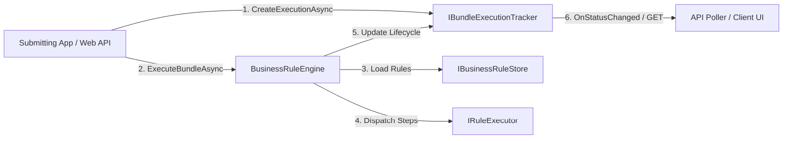

# AI Implementation Guide: EtlAnalytics.RulesEngine

This guide provides structured technical guidelines, code patterns, and best practices for AI agents (and developers using AI coding assistants) to integrate, extend, generate rules for, and operate the `EtlAnalytics.RulesEngine` package.

---

## 1. Quick Reference Architecture



### Core Components
- **`BusinessRuleEngine<TContext>`**: Main orchestrator. `TContext` inherits from `RuleExecutionContext`.
- **`IBusinessRuleStore`**: Sourcing interface for `BusinessRule`, `BusinessRuleBundle`, and `DbConnectionDefinition`.
- **`IBundleExecutionTracker`**: Thread-safe observer and state store for async monitoring (`Pending` $\rightarrow$ `Starting` $\rightarrow$ `Completed` / `Failed` / `Skipped`).
- **`IRuleExecutor` / `ISqlRuleExecutor`**: Language-specific execution implementations (TSQL, C#, Javascript).

---

## 2. Model Definitions & Properties

### `BusinessRule`
- `Id` (`int`): Primary key.
- `Name` (`string`): Unique rule identifier.
- `RuleType` (`string`): Language type string (`RuleConstants.TSQL`, `RuleConstants.CSharp`, `"Javascript"`).
- `Code` (`string`): Executable script body.
- `ConnectionId` (`int?`): Optional connection link to run T-SQL rules against cross-database instances.
- `Categories` (`List<string>`): Organizational tags (e.g., `["Finance", "Compliance"]`).
- `Tags` (`List<string>`): Searchable labels (e.g., `["PCI-DSS", "Nightly"]`).

### `BusinessRuleBundle`
- `Name` (`string`): Bundle identifier.
- `Items` (`List<BusinessRuleBundleItem>`): Sequence items containing `RuleId` and `SequenceOrder`.
- `Categories` (`List<string>`): Organizational categories.
- `Tags` (`List<string>`): Searchable labels.

### `RuleExecutionContext` (Base Class)
- `PreviousResult` (`object?`): Result from the preceding step (or `List<object?>` if following a parallel group).
- `StepResults` (`Dictionary<int, object?>`): Historical step results indexed by `SequenceOrder`.
- `CancellationToken`: Execution timeout cancellation token (default 10s for C#, 30s for SQL).

---

## 3. CRITICAL Constraints & AI Anti-Patterns to Avoid

When generating rule scripts or integrating the library using AI, adhere to these mandatory security and sandbox rules:

> [!CAUTION]
> ### Rule 1: NO Direct Network or File System I/O in C# Rules
> **Constraint**: C# Roslyn sandbox blocks `System.IO`, `System.Net`, `System.Diagnostics`, and `System.Reflection`.
> - **WRONG**: `var client = new HttpClient(); await client.GetAsync("https://api.com");` $\rightarrow$ **Throws Compilation Exception**
> - **RIGHT**: Expose I/O methods on your custom `TContext` class and invoke them in the script:
>   ```csharp
>   // 'Context' property provides access to your TContext
>   var response = await Context.HttpClientWrapper.GetAsync("https://api.com");
>   ```

> [!CAUTION]
> ### Rule 2: NO Direct `INSERT`, `UPDATE`, `DELETE`, `DROP` in T-SQL Rules
> **Constraint**: The SQL security sandbox scans and blocks data-modification keywords (`DROP`, `TRUNCATE`, `DELETE`, `UPDATE`, `INSERT`, `GRANT`, `CREATE`, `ALTER`).
> - **WRONG**: `UPDATE Orders SET Status = 'Processed' WHERE OrderId = 123;` $\rightarrow$ **Throws SecurityException**
> - **RIGHT**: Use a Stored Procedure via `EXEC`:
>   ```sql
>   EXEC dbo.sp_UpdateOrderStatus @OrderId = 123, @Status = 'Processed';
>   ```

> [!IMPORTANT]
> ### Rule 3: Handle `List<object?>` when Following Parallel Sequence Groups
> **Constraint**: Rules sharing the same `SequenceOrder` execute concurrently via `Task.WhenAll`, and their results are aggregated into a `List<object?>`.
> - **Sequential Step**: `PreviousResult` contains the single return object from step N-1.
> - **Parallel Step**: `PreviousResult` contains `List<object?>` from all rules in sequence group N-1:
>   ```csharp
>   var parallelList = (List<object?>)PreviousResult;
>   var rule1Result = parallelList[0]; // 1st parallel rule item
>   var rule2Result = parallelList[1]; // 2nd parallel rule item
>   ```

---

## 4. AI Rule Generation Prompts & Compliant Output Examples

### C# Rule Generation Prompt Example
> *"Generate a C# Business Rule script that checks if `OrderTotal` in `Context` exceeds $100. If so, log a message and return 15.0 discount, otherwise return 0.0."*

#### Compliant C# Script Output:
```csharp
if (OrderTotal > 100.0)
{
    Log("High value order discount applied.");
    return 15.0;
}
return 0.0;
```

### T-SQL Rule Generation Prompt Example (SQL Server)
> *"Generate a SQL Server T-SQL rule that receives the customer ID from the previous rule result (`@PreviousResultJson`) and queries VIP status."*

#### Compliant T-SQL Script Output:
```sql
SELECT TOP 1 CustomerId, VIPStatus 
FROM dbo.Customers 
CROSS APPLY OPENJSON(@PreviousResultJson) WITH (CustomerId INT '$.CustomerId') p
WHERE dbo.Customers.CustomerId = p.CustomerId;
```

---

## 5. Non-Blocking Asynchronous Web API Pattern (AI Integration Template)

When instructing an AI to implement an API controller that executes business rule bundles asynchronously:

```csharp
[ApiController]
[Route("api/rules")]
public class BusinessRuleController : ControllerBase
{
    private readonly BusinessRuleEngine<MyAppContext> _engine;
    private readonly IBusinessRuleStore _store;
    private readonly IBundleExecutionTracker _tracker;

    public BusinessRuleController(
        BusinessRuleEngine<MyAppContext> engine,
        IBusinessRuleStore store,
        IBundleExecutionTracker tracker)
    {
        _engine = engine;
        _store = store;
        _tracker = tracker;
    }

    [HttpPost("bundle/{bundleName}/execute-async")]
    public async Task<IActionResult> ExecuteBundleAsync(string bundleName, [FromBody] MyAppContext context)
    {
        var bundle = await _store.GetBusinessRuleBundleByNameAsync(bundleName);
        if (bundle == null) return NotFound($"Bundle '{bundleName}' not found.");

        // 1. Pre-populate initial 'Pending' execution state
        var executionState = await _tracker.CreateExecutionAsync(bundle);
        Guid executionId = executionState.ExecutionId;

        // 2. Fire and forget in background task (non-blocking)
        _ = Task.Run(async () =>
        {
            await _engine.ExecuteBundleAsync(
                bundle, 
                context, 
                appendLog: null, 
                tracker: _tracker, 
                executionId: executionId);
        });

        // 3. Return 202 Accepted immediately with tracking ID
        return Accepted(new { executionId, status = "Pending" });
    }

    [HttpGet("status/{executionId:guid}")]
    public async Task<IActionResult> GetStatus(Guid executionId)
    {
        var status = await _tracker.GetExecutionAsync(executionId);
        if (status == null) return NotFound($"Execution ID '{executionId}' not found.");
        return Ok(status);
    }
}
```

---

## 6. Categorization & Tag Searching (AI Integration Pattern)

AI agents can search or filter rules and bundles by category or tag using the `IBusinessRuleStore` search methods:

```csharp
// Retrieve all security or compliance rules
var securityRules = await store.GetRulesByCategoryAsync("Security");

// Retrieve all nightly automated bundles
var nightlyBundles = await store.GetBundlesByTagAsync("Nightly");
```

---

## 7. Configuration Keys

Customize timeouts and security settings in `appsettings.json`:

```json
{
  "Security": {
    "EncryptionKey": "YourSecretEncryptionKeyHere"
  },
  "RulesEngine": {
    "SqlTimeoutSeconds": 60,
    "ScriptTimeoutSeconds": 15,
    "ForbiddenSqlKeywords": [
      "DROP",
      "TRUNCATE",
      "DELETE",
      "UPDATE",
      "INSERT",
      "ALTER",
      "CREATE",
      "xp_cmdshell"
    ],
    "WithReferences": [
      "System.Runtime",
      "System.Linq",
      "System.Text.Json"
    ],
    "WithImports": [
      "System",
      "System.Collections.Generic",
      "System.Linq"
    ]
  }
}
```

---

## 8. AI Implementation Checklist

When integrating or testing `EtlAnalytics.RulesEngine` with AI tools:

- [x] Ensure `TContext` inherits from `RuleExecutionContext`.
- [x] Register `services.AddBusinessRulesEngineTracking()` in DI for execution tracking.
- [x] Run startup table migrations using `SqlDatabaseService.CreateBusinessRuleTablesIfNotExistsAsync()` or [SCHEMA_UPGRADE.md](SCHEMA_UPGRADE.md).
- [x] Verify C# scripts do not import blocked namespaces (`System.IO`, `System.Net`).
- [x] Verify T-SQL rules use Stored Procedures (`EXEC`) for database writes instead of direct `UPDATE`/`INSERT`.
